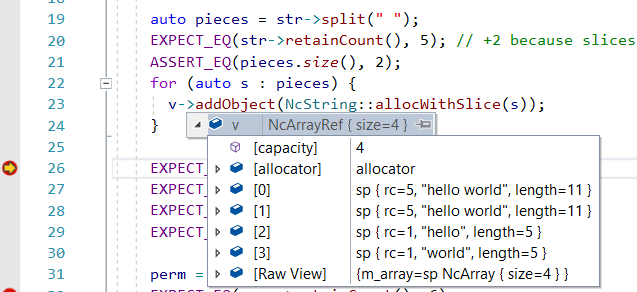

[](https://github.com/kingsimba/nc-runtime/actions)

# NC-Runtime <!-- omit in toc -->

> **WARNING:** A work in progress

- [Contents](#contents)
  - [Smart Pointer](#smart-pointer)
    - [Rules of using `sp`.](#rules-of-using-sp)
  - [String Class](#string-class)
  - [Foundation Classes: NcObject, NcArray, NcString, etc](#foundation-classes-ncobject-ncarray-ncstring-etc)
  - [StackOrHeapAllocator](#stackorheapallocator)
  - [ManualResetEvent](#manualresetevent)
  - [Many more good stuffs](#many-more-good-stuffs)
- [Design Notes](#design-notes)
  - [std::shared_ptr vs self-implemented smart pointer.](#stdshared_ptr-vs-self-implemented-smart-pointer)
    - [The internal of shared_ptr](#the-internal-of-shared_ptr)
    - [Try to use shared_ptr](#try-to-use-shared_ptr)
    - [Things I like & dislike](#things-i-like--dislike)
    - [Allow implicit conversion](#allow-implicit-conversion)
    - [Makes all memory in one piece with `sp`](#makes-all-memory-in-one-piece-with-sp)
  - [`auto` keyword](#auto-keyword)
  - [String literals](#string-literals)
  - [Log System](#log-system)
  - [Visual Studio Visualizer](#visual-studio-visualizer)
  - [Implement operator [] for `sp<NcArray>`](#implement-operator--for-spncarray)
  - [Closure(Lambda Functions)](#closurelambda-functions)

# Contents

In my humble opinion, unlike other modern programming languages, C++ lacks some important infrastructures.
Everyone have to invent their own wheel. And so am I.

This project contains the methodology & wheels which I found useful.
They may not be the best ideas. But I hope you may find some pieces useful.

## Smart Pointer

`std::shared_ptr` gives a good direction in automating memory management.
But I'd like to offer a slightly different implementation.

The smart pointer `sp` and `wp` works in many ways like `std::shared_ptr` and `std::weak_ptr`.

```cpp
// get() and use_count() works the same as std::shared_ptr
sp<NcData> data = NcData::allocWithBytes("hello", 5);
EXPECT_EQ(data->length(), 5);   // overload operator '->'
EXPECT_EQ(data.use_count(), 1);

// create sp
sp<NcString> str = NcString::allocWithCString("hello");

NcString* raw = str.get();  // strong -> raw
sp<NcString> s2 = retainToSp(raw); // raw -> strong

wp<NcString> w(str);	// strong -> weak
sp<NcString> s = w.lock(); 		// weak -> strong
if (s != nullptr)
{
    use(s);
}
```

But they also bear some differences:

1.  There is a base class `NcObject`. `sp<>` only works on it.

    `NcObject` contains some common used methods. Such as `toString()`, `isKindOf()` and `equals()`.
    They can be used to make fancy things like:

    ```cpp
    // ""_str is short for NcString::allocWithCString(const char* str);
    auto arr = NcArray::allocWithObjects("hello"_str, "world"_str, NULL);

    // any object can be coverted to string
    auto str = NcString::format("array %@ with length %d", arr, arr->length());
    EXPECT_EQ(str, "array [\"hello\", \"world\"] with length 2");
    ```

    ```cpp
    // deep & generic comparison
    auto array1 = NcArray::allocWithObjects(obj1, obj2, NULL);
    auto array2 = NcArray::alloc();
    array2->push(obj1);
    array2->push(obj2);
    array1->equals(array2); // should be true
    ```

    ```cpp
    // type identification
    sp<NcObject> box = MyBox::alloc();
    EXPECT_TRUE(box->isKindOf<MyBox>());
    EXPECT_TRUE(box->isKindOf<NcObject>());
    EXPECT_FALSE(box->isKindOf<NcString>());
    ```
   
2.  There is a `operator[]` in `sp`. It makes indexing into array easier

    ```cpp
    auto arr = NcArray::allocWithObject(obj1, obj2, NULL);
    printf(arr[0]->toString());
    printf(arr[1]->toString());
    ```

3.  It supports manual reference counting through `retain()` and `release()`.
    though their uses should be restricted(like when working with 3rd-party C API).

    ```cpp
    auto userData = UserData::alloc()
    SomeOldSdk_setUserData((void*)retain(userData.get())); // manually increase RC
    SomeOldSdk_setDeleteCallback([](void* userdata) {
        UserData* data = (UserData*)userdata;
        release(data); // manually decrease RC
    });
    ```

4.  The memory layout is more efficient for some objects.

    Consider the following code:

    ```cpp
    auto str1 = std::make_shared<std::string>("hello");
    ```

    There are three memory blocks (all on heap) for str1:
        
        *   the control block used by `shared_ptr`
        *   the string object
        *   the contained string "hello"

    `std::make_shared` smartly combine the first two block in one `malloc()`. 
    But the contained string requires a separate `malloc()`.

    With `NcString`, all 3 blocks are created in one `malloc()`.
    Please see the implementation for how it works.

    ```cpp
    auto str2 = NcString::allocWithCString("hello");
    ```

    The same optimization is used for `NcData`.


## String Class

I want a string class which is both intuitive and efficient.
`StringSlice` is created just for that. It's always on stack and cheap to copy.

> **Notes:** The name 'slice' is borrowed from Golang's slice concept.

Unlike C string, which requires a '\0' ending, `StringSlice` contains a start pointer and a length.
So creating a subslice is very cheap(just advance the pointer and reassign the length). 
Consider the following code, there is not a single `malloc()/free()` in it.

```cpp
StringSlice slice = "hello---world"_s;
StringSlice pieces[3];
int num = slice.splitWithLimit("---", pieces, countof(pieces));
ASSERT_EQ(num, 2);
EXPECT_TRUE(pieces[0] == "hello");
EXPECT_TRUE(pieces[1] == "world");
```

StringSlice doesn't have `operator +`. I think it's a root of bad performance.
But I added `join` and `format`. They are better and faster.

```cpp
std::vector<StringSlice> lines({"hello", "world", ""});
EXPECT_EQ("\n"_s.join(lines), "hello\nworld\n");

EXPECT_EQ(StringSlice::format("%s %s", "hello", "world"), "hello world");
```

Most of the time, StringSlice manages the memory safely.
For example:

```cpp
auto str1 = "hello world"_s; // use literal memory
auto str2 = StringSlice::format("hello %s", "world"); // it allocate memory internally
```

But sometimes, you should be more careful.

```cpp
// `str1` takes ownership of the memory, and will call `free()` when it's not needed'
char* buffer = json_dumps(jsonNode);
auto str1 = StrinSlice::makeByTakingCString(buffer);

char buffer[MAX_PATH];
getcwd(buffer, MAX_PATH);
// Careful: str2 will be invalid when `buffer` goes out of scope
auto str2 = StringSlice::makeEphemeral(buffer);
// `StringSlice::make()` will make a copy of the memory. It's safer, albeit slower.
auto str3 = StringSlice::make(buffer);
```

## NcString

`NcString` is on heap. It's derived from NcObject.
For most cases, please use `StringSlice` instead of `NcString`.
Use `NcString` only when you need an `NcObject` derived object.
For example, when you want to put it into `NcArray<>` or `NcHashmap<>`.

```cpp
auto str = "hello---world"_str;
// splitting a string will only create StringSlices. So it's very fast.
auto slices = str->split("---");
EXPECT_EQ(str->retainCount(), 3); // because each slice holds a reference to the string
EXPECT_TRUE(slices[0].equals("hello"));
EXPECT_TRUE(slices[1].equals("world"));
```

Both `StringSlice` and `NcString` have rich set of functions, such as:

```cpp
"freeman"_s.startsWith("free");
"freeman"_s.endsWith("man");
EXPECT_EQ("internationalization"_s.countSlice("tion"), 2);
auto str = NcString::format("%s shall come", "The Day"); // The Day shall come
```

## StackOrHeapAllocator

In some functions, stack is enough for most cases. But occasionally, larger memory is required.

For example, in NcLog_write(), `char message[2048]' is very, very likely to be enough, but we can't count on it. StackOrHeapAllocator is invented exactly for situations like that.

```cpp
TEST(Stdlib, stackOrHeapAllocator) {
   u8* stack = (u8*)alloca(1024);
   StackOrHeapAllocator allocator(stack, 1024);
   EXPECT_EQ(allocator.allocArray<u8>(512) - stack, 0);
   EXPECT_EQ(allocator.allocArray<u8>(512) - stack, 512);
   EXPECT_GT(allocator.allocArray<u8>(1) - stack, 4096); // stack used up, so it's on heap

   // no leak
}
```

All allocated memory will be freed when `allocator` goes out of scope.

## ManualResetEvent

It simulate Win32 API `SetEvent()`. With C++11's `condition_variable` it's much easier.
I learned it from https://stackoverflow.com/questions/1501111/boost-equivalent-of-manualresetevent

```cpp
ManualResetEvent e;

std::thread t([&] {
   Thread::sleep(100);
   e.set();
});

// must wait until reset
TimeTick start = TimeTick::now();
e.wait();
TimeTick duration = TimeTick::now() - start;
EXPECT_GE(duration.ms(), 100);

t.join();

// not reset(). So wait on it will not block
start = TimeTick::now();
e.wait();
duration = TimeTick::now() - start;
EXPECT_LT(duration.ms(), 1);

// reset() again. Wait will block
e.reset();
start = TimeTick::now();
EXPECT_FALSE(e.waitWithTimeout(10));
duration = TimeTick::now() - start;
EXPECT_GE(duration.ms(), 10);
```

## Many more good stuffs

- Log System
- NcCache

# Design Notes

To be honest, I fall behind in terms of modern C++. Because I held a biased and negative attitude 
towards it and didn't spend much time to learn it. 
And in the New Years Days of 2021, I decide to rediscover modern C++. 
And see how things can be different if I use C++ 14.

## std::shared_ptr vs self-implemented smart pointer.

### The internal of shared_ptr

Before discussing the pros-and-cons of both implementations, I dive into the internal of `std::shared_ptr`

At first, I think `std::shared_ptr` will have to make one additional malloc() for the control block.
Until I read from https://www.nextptr.com/tutorial/ta1358374985/shared_ptr-basics-and-internals-with-examples:

> We mentioned above that the control block could either contain a pointer to
> the managed object or the object itself.
> The control block is dynamically allocated. Constructing the managed object in-place
> within the control block can avoid the two separate memory allocations for the object
> and the control block, resulting in an uncomplicated control block and better performance.
> The std::make_shared is a preferred way to construct a shared_ptr because it builds the
> managed object within the control block.

Later, I also learned there is `std::enabled_shared_from_this`. It can put the control block into the base object.

### Try to use shared_ptr

So I think `std::shared_ptr` might be good enough for my need. And write something out of it:

```cpp
class NcObject : public std::enable_shared_from_this<NcObject> {
};

class Time : public NcObject {
public:
  // I like allocWith() over constructors. Because it allows overloading
  static shared_ptr<Time> allocWithSeconds(int sec) { return std::make_shared<Time>(sec * 1000); }
  static shared_ptr<Time> allocWithMilliseconds(int ms) { return std::make_shared<Time>(ms); }

  // Problem: Constructors must be public. Because std::make_shared needs it.
  Time(int ms) : m_milliseconds(ms) {};

  sp<Time> self() {
     return static_pointer_case<Time>(shared_from_this());
  }

private:
  int m_milliseconds;
};

TEST(NcObject, basic) {
  auto t = Time::allocWithSeconds(10);

  // cast to base
  shared_ptr<NcObject> base = t;
  EXPECT_EQ(t.use_count(), 2);

  // cast to derived
  auto t2 = std::static_pointer_cast<Time>(base);
  EXPECT_EQ(t.use_count(), 3);
  EXPECT_TRUE(t.get() == t2.get()); // underlying the same object

  auto t3 = t->self();
  EXPECT_EQ(t.use_count(), 4);
}
```

`Time::self()` makes an important point to implement something like
`auto pieces = "hello-world"_str->split("-")`.
Each piece contains a strong reference to the original string.

### Things I like & dislike

Like:

1. Strong/weak. It makes delegate design pattern more robust.
2. Can put control block along with the controlled object.

Dislike:

1. Constructors must be public. Some user may call delete or create the object on stack.
2. Convert from raw pointer back to `shared_ptr` is inconvenient.
3. Must call `.get()` to get raw pointer.

I shall explain myself in the following sections.

### Allow implicit conversion

`std::shared_ptr` avoids implicit conversion, for a [good reason](https://www.informit.com/articles/article.aspx?p=31529&seqNum=7). You have to call `.get()` to get a raw pointer.

But I think, for this reason(inconveniency to convert to raw pointer), it tends to be abused by unexperienced programmers.
It pops up everywhere. And there are too many ways of using it:

```cpp
void f(widget* );
void f(widget& );
void f(shared_ptr<widget> );
void f(const shared_ptr<widget>& );
```

About the correct rules for using `shared_ptr`, I agree with [Sutter’s Mill](https://herbsutter.com/2013/06/05/gotw-91-solution-smart-pointer-parameters/) and [acel](https://stackoverflow.com/questions/3310737/should-we-pass-a-shared-ptr-by-reference-or-by-value)

> - Guideline: Don’t pass a smart pointer as a function parameter unless you want to use or manipulate the smart pointer itself, such as to share or transfer ownership.
> - Guideline: Express that a function will store and share ownership of a heap object using a by-value shared_ptr parameter.
> - Guideline: Use a non-const shared_ptr& parameter only to modify the shared_ptr. Use a const shared_ptr& as a parameter only if you’re not sure whether or not you’ll take a copy and share ownership; otherwise use widget\* instead (or if not nullable, a widget&).

So I derived my [rules of using `sp`](#rules-of-using-sp). I think it's more error-proof.

### Makes all memory in one piece with `sp`

With self-implemented control-block in NcObject. I can do some deep optimization, like appending the text directly after the NcString object.
Thus creating the string with a single allocation.
See `allocWithCString::allocWithCString()`

## `auto` keyword

The `auto` keyword makes writing code a breeze. Especially so for rarely used types or templated types.

```cpp
auto iter = str->iter(); // iter is of type StringCharacterIterator.
auto pieces = str->split(); // pieces is of type std::vector<StringSlice>
```

But at the cost of making it harder to read or navigate:

1. With VS2019, you have to hover the cursor on top of the variable to see its type.

   > **NOTE:** Android Studio inserts gray text to mark the type
   > behind the variable name, which is very nice.
   >
   > ```cpp
   > auto slices : vector<StringSlice> = "hello---world"_s.split("---");
   > ```

2. You can't easily ctrl+click to jump to type definition.
3. It creates room for mistakes when using basic types.

   ```cpp
   auto a = 3.0;
   // b is double, because a is accidentally created as double.
   // But I might think b is an integer.
   auto b = a + 3;
   ```

But overall, I think it's worthwhile to use `auto`. Especially for complex types. But for basic types, I prefer to make the type explicit.

## Log System

There are often too many aims for a log system:

1. filter with level
2. filter with tags
3. generated message should contains file, line number, functions name
4. support writing to debugger/console/file/remote server
5. support packaging if file is too large

I think the last two requirements are too task-dependent.
(For example, if you are writing server programs, you may want to collect logs with Kubernetes
and then send to Elasticsearch)
So I shall write a log system which only support the first 3 requirements.
By default, the log messages will be written to Visual Studio Debugger(Windows) and
console(Windows & Linux).
But the default behavior can be overridden with NcLog_setCallback().

## Visual Studio Visualizer

`nc-runtime.natvis` is used to improve the debugging experience in Visual Studio.

Visualizer are included for `NcArray`, `sp`, `NcString`, `StringSlice` etc



## Implement operator [] for `sp<NcArray>`

`sp<NcArray>` should work just like ordinary array:

```cpp
auto v = NcArray<NcString>::alloc();
v->addObject("hello"_str);
auto& s = v[0]; // use []
```

To support than:

1. In order to detect element type, a `NcObject::ArrayElement` and `NcArray::ArrayElement` are added.

   NcObject::ArrayElement is unnecessary. There might be a better solution?

   ```cpp
   class NcObject {
   public:
      using ArrayElement = NcObject;
   }

   template <typename T>
   class NcArray : public NcObject {
   public:
      using ArrayElement = T;
   }
   ```

2. Implement operator [] in `sp`

   ```cpp
   template <typename T>
   class sp {
     /**
     * For accessing array element(If it's an array)
     */
     sp<T::ArrayElement>& operator[](int index) {
       return m_ptr->objectAtIndex(index]);
     }
   }
   ```

## Closure(Lambda Functions)

`NcArray::findWithCondition()` uses lambda expression.
See https://www.cprogramming.com/c++11/c++11-lambda-closures.html.

```cpp
auto v = NcArray<NcString>::alloc();
v->addObject(NcString::allocWithCString("hello"));
v->addObject(NcString::allocWithCString("world"));

auto startWord = "w"_s;
auto obj = v->findWithCondition([&](NcString* v) {
   return v->startsWith(startWord);
});
```

The capture syntax is more convenient than the old `userData`:

```cpp
typedef bool(*ArrayFinder)(T* obj, void* userData);
sp<T> findWithCondition(Array finder, void* userData);
```
