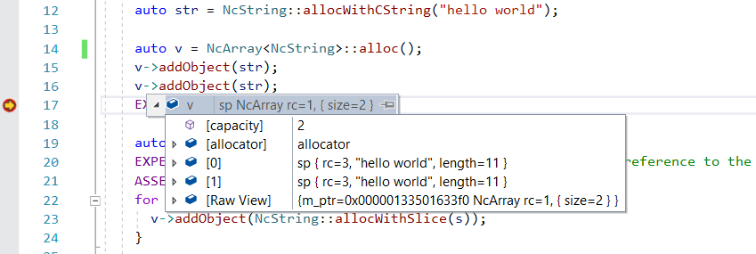

[](https://github.com/kingsimba/nc-runtime/actions)

# NC-Runtime <!-- omit in toc -->

> **WARNING:** A work in progress

- [Contents](#contents)
  - [Smart Pointer](#smart-pointer)
  - [String Class](#string-class)
  - [Foundation Classes: NcObject, NcArray, NcString, etc](#foundation-classes-ncobject-ncarray-ncstring-etc)
  - [StackOrHeapAllocator](#stackorheapallocator)
  - [ManualResetEvent](#manualresetevent)
  - [Many more good stuffs](#many-more-good-stuffs)
- [Design Notes](#design-notes)
  - [std::shared_ptr vs self-implemented smart pointer.](#stdshared_ptr-vs-self-implemented-smart-pointer)
  - [`auto` keyword](#auto-keyword)
  - [String literals](#string-literals)
  - [Log System](#log-system)
  - [Visual Studio Visualizer](#visual-studio-visualizer)
  - [Implement operator [] for `sp<NcArray>`](#implement-operator--for-spncarray)
  - [Closure(Lambda Functions)](#closurelambda-functions)

# Contents

In my humble opinion, unlike other modern programming languages, C++ lacks some important infrastructures.
Everyone have to invent their own wheel. And so am I.

This project contains the methodology & wheels which I found useful.
They may not be the best ideas. But I hope you may find some pieces useful.

## Smart Pointer

`std::shared_ptr` gives a good direction in automating memory management.
But I'd like to offer a slightly different approach.

The smart pointer `sp` and `wp` works in many ways like `std::shared_ptr` and `std::weak_ptr`.

```cpp
// get() and use_count() works the same as std::shared_ptr
sp<NcData> data = NcData::allocWithBytes(buffer, len);
EXPECT_EQ(data.get()->length(), data->length());   // overload operator '->'
EXPECT_EQ(data.use_count(), 1);
```

But they also bear important differences. Such as: The raw pointer and smart pointer can be freely converted to each other.

```cpp
sp<NcString> p1 = NcString::allocWithCString("hello");
NcString* raw = p1.get();  // sp -> raw
sp<NcString> p2 = retain(raw);   // raw -> sp
```

This enables calling functions with raw pointer parameters:

```cpp
void myFunction(NcString* str) // raw pointer

sp<NcString> s = NcString::allocWithCString("abc");
myFunction(s); // implicit conversion to raw pointer. Not possible with std::shared_ptr.
```

And it allows to retake ownership from raw pointer.

```cpp
void SomeObject::setName(NcString* name) {
   m_name = retain(name);  // retake ownership from raw pointer
}
```

Convert between strong/raw and weak:

```cpp
wp<NcString> w(str);	// strong/raw to weak
auto s = w.lock(); // weak to strong
```

## String Class

I want a string class which is both intuitive and efficient.

`StringSlices` is always on stack. It only contains a `char*` and a `length`. There is no heap memory allocation. So it's very fast.

```cpp
StringSlice slice = "hello---world"_s;
vector<StringSlice> pieces = slice.split("---");
EXPECT_TRUE(pieces[0].equals("hello"));
EXPECT_TRUE(pieces[1].equals("world"));
```

`NcString` is on heap. There is one `malloc()` for each string.

```cpp
auto str = NcString::allocWithCString("hello---world");
// splitting a string will only create StringSlices. So it's very fast.
auto slices = str.split("---");
EXPECT_EQ(str->retainCount(), 3); // because each slice holds a reference to the string
EXPECT_TRUE(slices[0].equals("hello"));
EXPECT_TRUE(slices[1].equals("world"));
```

Both `StringSlice` and `NcString` have rich set of functions, such as:

```cpp
"freeman"_s.startsWith("free");
"freeman"_s.endsWith("man");
EXPECT_EQ("internationalization"_s.countSlice("tion"), 2);
auto str = NcString::format("%s shall come", "The Day"); // The Day shall come
```

## Foundation Classes: NcObject, NcArray, NcString, etc

I want some foundation classes such as `NcObject`, `NcArray`, `NcString`. They enable things like:

- Type identification

   ```cpp
   sp<NcObject> box = MyBox::alloc();
   EXPECT_TRUE(box->isKindOf<MyBox>());
   EXPECT_TRUE(box->isKindOf<NcObject>());
   EXPECT_FALSE(box->isKindOf<NcString>());
   ```

- All objects can be converted in string.

   ```cpp
   auto str = o->toString();
   ```

- C style format can be extended to support any NcObject.

   ```cpp
   auto arr = NcArray<NcString>::alloc();
   arr->addObject("Earth"_str);
   arr->addObject("Mars"_str);
   arr[1] = "Jupiter"_str;
   EXPECT_STREQ(NcString::format("Hello %@", arr)->cstr(), "Hello [\"Earth\", \"Jupiter\"]");
   ```

## StackOrHeapAllocator

In some functions, stack is enough for most cases. But occasionally, larger memory is required.

For example, in NcLog_write(), `char message[2048]' is very, very likely to be enough, but we can't count on it. StackOrHeapAllocator is invented exactly for situations like that.

```cpp
TEST(Stdlib, stackOrHeapAllocator) {
   u8* stack = (u8*)alloca(1024);
   StackOrHeapAllocator allocator(stack, 1024);
   EXPECT_EQ(allocator.allocArray<u8>(512) - stack, 0);
   EXPECT_EQ(allocator.allocArray<u8>(512) - stack, 512);
   EXPECT_GT(allocator.allocArray<u8>(1) - stack, 4096); // stack used up, so it's on heap

   // no leak
}
```

All allocated memory will be freed when `allocator` goes out of scope.

## ManualResetEvent

It simulate Win32 API `SetEvent()`. With C++11's `condition_variable` it's much easier.
I learned it from https://stackoverflow.com/questions/1501111/boost-equivalent-of-manualresetevent

```cpp
ManualResetEvent e;

std::thread t([&] {
   Thread::sleep(100);
   e.set();
});

// must wait until reset
TimeTick start = TimeTick::now(); 
e.wait();
TimeTick duration = TimeTick::now() - start;
EXPECT_GE(duration.ms(), 100);

t.join();

// not reset(). So wait on it will not block
start = TimeTick::now(); 
e.wait();
duration = TimeTick::now() - start;
EXPECT_LT(duration.ms(), 1);

// reset() again. Wait will block
e.reset();
start = TimeTick::now();
EXPECT_FALSE(e.waitWithTimeout(10));
duration = TimeTick::now() - start;
EXPECT_GE(duration.ms(), 10);
```

## Many more good stuffs

- Log System
- NcCache

# Design Notes

To be honest, I fall behind in terms of modern C++. Because I held a biased and negative attitude towards it and didn't spend much time to learn it. And in the New Years Days of 2021, I decide to rediscover modern C++. And see how things can be different if I use C++ 14.

## std::shared_ptr vs self-implemented smart pointer.

Historically, I always do RC in a base class. But I wanted to try out `std::shared_ptr` this time.

The most important implementation difference I noticed is that:

- For std::shared_ptr, the control block(contains RC, weak_ptrs) is put outside of the object.
  (Note: Later, I learned that there is a std::enabled_shared_from_this. I shall update the document when I have time.)
- For most self-implemented RC, the control block is in the base object.

At first, I think `std::shared_ptr` will have to make one additional malloc() for the control block.
Until I read from https://www.nextptr.com/tutorial/ta1358374985/shared_ptr-basics-and-internals-with-examples:

> We mentioned above that the control block could either contain a pointer to
> the managed object or the object itself.
> The control block is dynamically allocated. Constructing the managed object in-place
> within the control block can avoid the two separate memory allocations for the object
> and the control block, resulting in an uncomplicated control block and better performance.
> The std::make_shared is a preferred way to construct a shared_ptr because it builds the
> managed object within the control block.

So I think `std::shared_ptr` might be good. And write NcObject, NcString, NcArray out of it:

```cpp
class MyBox : public NcObject {
public:
  static sp<MyBox> alloc() { return std::make_shared<MyBox>(); }

  MyBox(){};   // must be public. Because std::make_shared needs it.
};

TEST(NcObject, cast) {
  auto box = MyBox::alloc();

  // cast to base
  sp<NcObject> base = box;
  EXPECT_EQ(box.use_count(), 2);

  // cast to derived
  auto box2 = std::static_pointer_cast<MyBox>(base);
  EXPECT_EQ(box.use_count(), 3);
  EXPECT_TRUE(box.get() == box2.get());
}
```

So far so good. Until I try to write something like this:

```cpp
TEST(NcString, split) {
  vector<StringSlice> slices = NcString::allocWithCString("hello---world")->split("---");
  auto s = NcString::allocByJoiningSlices(slices, " ");
  EXPECT_STREQ(s->cstr(), "hello world");
  EXPECT_EQ(s->length(), 11);
}
```

First, `NcString::allocWithCString()` creates `shared_ptr<NcString>`.
Then `NcString::split()` split it into slices. Each slice should hold a RC to the original string.
So in `split()` the RC must be increased.
This is impossible with `std::shared_ptr`.

And there is another slight inconveniency:

```cpp
static int _calculateStringLength(NcString* str) { return str->length(); }

TEST(NcString, basic) {
  sp<NcString> s = NcString::allocWithCString("hello");
  // must call .get() to convert to ordinary pointer.
  EXPECT_EQ(_calculateStringLength(s.get()), 5);
}
```

You have to call `.get()` to get a raw pointer. There is no implicit conversion, though for a good reason https://www.informit.com/articles/article.aspx?p=31529&seqNum=7.

Third, with self-implemented RC in NcObject. I can do some deep optimization, like appending the text directly after the NcString object.
Thus creating the string with a single allocation.

```cpp
class NcString
{
public:
   static NcString* allocWithCString(const char* str) {
      size_t len = strlen(str) + 1;
      NcString* o = (NcString*)malloc(sizeof(NcString) + len);
      new(o) NcString(); // call placement new
      o->m_length = len - 1;
      o->m_str = (char*)(o+1);
      memcpy(o->m_str, str, len);
      return o;
   }
}
```

For conclusion, after analysis, I still give self-implemented RC a go. Based on reasons:

1. `std::shared_ptr` implements the control block outside of the object. So you can't convert a raw pointer back into a smart pointer.
2. `std::shared_ptr` doesn't allow manual RC. I think it might be useful in some low-level classes.
3. I want complete control over how the RC is implemented and can make in-depth optimization.

## `auto` keyword

The `auto` keyword makes writing code a breeze. Especially so for rarely used types or templated types.

```cpp
auto iter = str->iter(); // iter is of type StringCharacterIterator.
auto pieces = str->split(); // pieces is of type std::vector<StringSlice>
```

But at the cost of making it harder to read or navigate:

1. With VS2019, you have to hover the cursor on top of the variable to see its type.

   > **NOTE:** Android Studio inserts gray text to mark the type
   > behind the variable name, which is very nice.
   >
   > ```cpp
   > auto slices : vector<StringSlice> = "hello---world"_s.split("---");
   > ```

2. You can't easily ctrl+click to jump to type definition.
3. It creates room for mistakes when using basic types.

   ```cpp
   auto a = 3.0;
   // b is double, because a is accidentally created as double.
   // But I might think b is an integer.
   auto b = a + 3;
   ```

But overall, I think it's worthwhile to use `auto`. Especially for complex types. But for basic types, I prefer to make the type explicit.

## String literals

C++11 support customized suffix for string literals.

```cpp
sp<NcString> operator""_str(const char* literalStr, size_t len);
StringSlice operator""_s(const char* literalStr, size_t len);
```

This enables creating of literal NcString object or StringSlice.

```cpp
sp<NcString> str = "hello world"_str;
StringSlice slice = "hello world"_s;
```

NcString object created in this way is considered "static".
It has `retainCount()` at INT_MAX.
Calling retain() or release() on it has no effect.
With a global string manager, it's possible to make sure only one NcString object is created for each string literal.

```cpp
TEST(NcString, literal) {
  sp<NcString> s1, s2;
  for (int i = 0; i < 2; i++) {
    sp<NcString> s = "hello world"_str;
    if (i == 0)
      s1 = s;
    else
      s2 = s;
  }

  // s1 is exactly the same as s2, because of the literal string manager.
  EXPECT_EQ(s1.get(), s2.get());

  auto s3 = "hello world"_s;
  // for s1 == s3, it must be compiled with /GF(enable string pool) for Visual Studio
  EXPECT_EQ(s1.get(), s3.get());
}
```

## Log System

There are often too many aims for a log system:

1. filter with level
2. filter with tags
3. generated message should contains file, line number, functions name
4. support writing to debugger/console/file/remote server
5. support packaging if file is too large

I think the last two requirements are too task-dependent.
(For example, if you are writing server programs, you may want to collect logs with Kubernetes
and then send to Elasticsearch)
So I shall write a log system which only support the first 3 requirements.
By default, the log messages will be written to Visual Studio Debugger(Windows) and
console(Windows & Linux).
But the default behavior can be overridden with NcLog_setCallback().

## Visual Studio Visualizer

`nc-runtime.natvis` is used to improve the debugging experience in Visual Studio.

Visualizer are included for `NcArray`, `sp`, `NcString`, `StringSlice` etc



## Implement operator [] for `sp<NcArray>`

`sp<NcArray>` should work just like ordinary array:

```cpp
auto v = NcArray<NcString>::alloc();
v->addObject("hello"_str);
auto& s = v[0]; // use []
```

To support than:

1. In order to detect element type, a `NcObject::ArrayElement` and `NcArray::ArrayElement` are added.

   NcObject::ArrayElement is unnecessary. There might be a better solution?
   
   ```cpp
   class NcObject {
   public:
      using ArrayElement = NcObject;
   }

   template <typename T>
   class NcArray : public NcObject {
   public:
      using ArrayElement = T;
   }
   ```

2. Implement operator [] in `sp`

   ```cpp
   template <typename T>
   class sp {
     /**
     * For accessing array element(If it's an array)
     */
     sp<T::ArrayElement>& operator[](int index) {
       return m_ptr->objectAtIndex(index]);
     }
   }
   ```

## Closure(Lambda Functions)

`NcArray::findWithCondition()` uses lambda expression.
See https://www.cprogramming.com/c++11/c++11-lambda-closures.html.

```cpp
auto v = NcArray<NcString>::alloc();
v->addObject(NcString::allocWithCString("hello"));
v->addObject(NcString::allocWithCString("world"));

auto startWord = "w"_s;
auto obj = v->findWithCondition([&](NcString* v) {
   return v->startsWith(startWord);
});
```

The capture syntax is more convenient than the old `userData`:

```cpp
typedef bool(*ArrayFinder)(T* obj, void* userData);
sp<T> findWithCondition(Array finder, void* userData);
```
